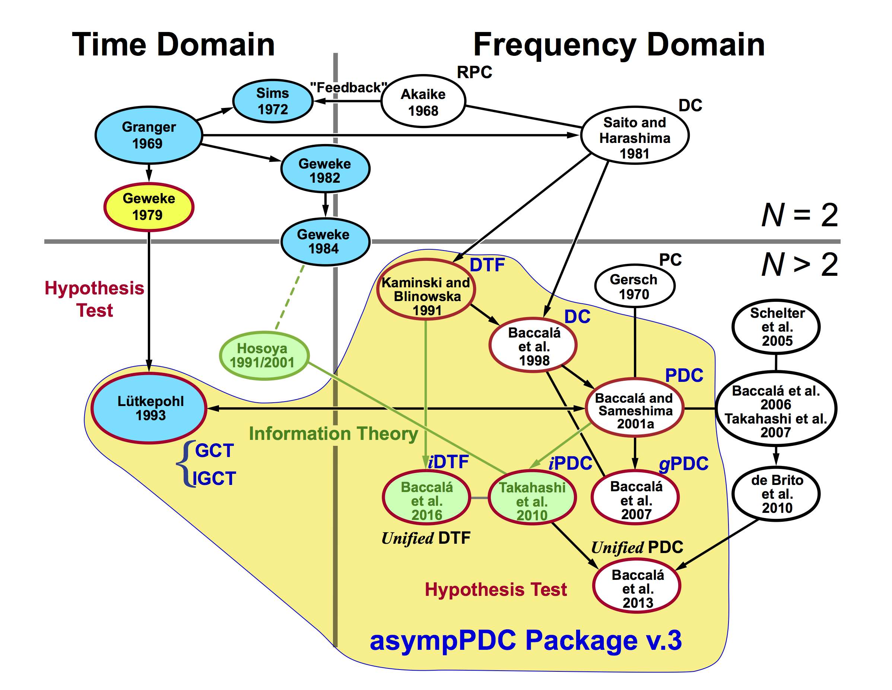

# MATLAB and Octave AsympPDC Toolbox

July 22, 2022

**The AsympPDC Package** is MATLAB/Octave routines and functions for the analysis of time series or biological signals to infer directional interactions between structures through the Partial Directed Coherence (**PDC**), which is based on the concept of Granger causality, and the Directed Transfer Function (**DTF**) in the frequency domain, both in three metrics --- Euclidean, diagonal and information --- and rigorous asymptotic statistics providing p-values and confidence interval in the frequency domain. 

## Installation and usage

The AsympPDC package contains MATLAB/Octave m-files and subfolders that you may copy into your local preferred working directory to execute them. To begin with you should go to the package directory and run the `startup.m` script in the MATLAB/Octave command line window that will set paths and check for the requirements.

```matlab
>> startup
```

Besides adding the paths, `startup.m` will also check for the presence of the required MATLAB toolboxes (Control System Toolbox(TM), Signal Processing Toolbox(TM), and Statistics Toolbox(TM) or Statistics or Machine Learning Toolbox(TM)) or Octave packages (control, signal, and statistics). This is a standalone package that will most likely  work in the recent versions of Octave --- 6.3.0, 6.4.0 and 7.1.0.  (Please report or suggest corrections to any issues related to compatibility with Octave).

To run all examples provided in `./examples` subdirectory and verify if your installation is working properly, execute:

```matlab
>> run_all_examples
```

If `"run_all_examples.m"` completes successfully, congratulation, you should see over 40 overlapped figures that you could examine, in MATLAB, through 

```matlab
>> tilefigs1
```

This command will distribute the figures across screen. The `tilefigs1` or `tilefigs2` function does not seem to work in the Octave environment.

## Our diagrammatic view of connectivity measures

The figure bellow shows  schematically the connectivity, Granger causality and allied concepts developed along the last half-century.  The measures inside the yellow area are those implemented in **The AsympPDC Package**.

  

  



* **Legend**: **N**  number of time series; **RPC** - relative power contribution; **DC** - directed coherence = generalized directed transfer function; **GCT** - Granger causality test; **iGCT** - Instantaneous Granger causality test; **DTF** - directed transfer function; **PC** - partial coherence; **PDC** - partial directed coherence; **gPDC** - generalized partial directed coherence; **iPDC** - information partial directed coherence; **iDTF** - information directed transfer function. 

* **Authors**: [Akaike 1968](https://doi.org/10.1007/BF02911655); [Granger 1969](https://www.jstor.org/stable/1912791); [Gersch 1970](https://doi.org/10.1126/science.169.3946.701); [Sims 1972](https://www.jstor.org/stable/1806097); [Geweke 1979](https://doi.org/10.1016/0304-4076(78)90067-2); [Saito and Harashima 1981](); [Geweke 1982](https://doi.org/10.2307/2287238); [Geweke 1984](https://doi.org/10.2307/2288723); [Kamiński and Blinowska 1991](https://doi.org/10.1007/bf00198091);  [Hosoya 1991](https://doi.org/10.1007/BF01192551); [Lütkepohl 1993 --> 2005](https://doi.org/10.1007/978-3-540-27752-1); [Hosoya 1994](); [Baccalá et al. 1998](); [Baccalá and Sameshima 2001](https://doi.org/10.1007/PL00007990); [Schelter et al. 2005](https://doi.org/10.1016/j.jneumeth.2005.09.001); [Baccalá et al. 2006](https://doi.org/10.1002/9783527609970.ch16);  [Takahashi et al. 2007](https://doi.org/10.1080/02664760701593065); [Baccalá et al. 2007](https://doi.org/10.1109/ICDSP.2007.4288544); [de Brito et al. 2010](https://doi.org/10.1109/IEMBS.2010.5626856); [Takahashi et al. 2010](https://doi.org/10.1007/s00422-010-0410-x); [Baccalá et al. 2013](https://doi.org/10.1098/rsta.2012.0158); [Baccalá et al. 2016](https://doi.org/10.1109/TBME.2016.2550199).


> 1. Lütkepohl, H. (1993) Introduction to Multiple Time Series Analysis. 2nd Edition, Springer, Berlin.
> 
> 2. Saito, Y. ad H. Harashima (1981) Tacking of information within multichannel record: causal analysis in EEG. In *Recent Advances in EEG and EMG Data Processing.* pp. 133--146, Amsterdam: Elsevier. (Not available in the Internet)


## Getting started road map

To get started, modify  the `analysis_template.m` script file to adapt it to your needs and data sets. This template file contains four examples of data that might be of help to deal with your own data sets. The basic steps to set up and analyze a data set using **the asympPDC Package** are:

1. Import or open row-vectors data file;

2. Choose proper label for your data, assigning values to `chLabels`  variable;

3. Data pre-processing: filtering, detrending and standardization (optional);

4. Multivariate autoregressive (MAR) model estimation, by choosing parameters, estimation algorithm and model order selection criterion;

5. PDC or DTF estimation, choosing analysis parameters such as significance levels for connectivity inference (`alpha`, `gct_signif` and `igct_signif`) , metric for PDC/DTF,  and number of frequency points, then call `asymp_pdc` or `asymp_dtf` function, and the analysis results will be saved in MATLAB `struct` variable that could be used for your further analysis, or to plot them; 

6. To visualize analysis results, use `xplot`, `xplot_pvalues` and `xplot_title` functions to properly format and plot PDC/DTF and corresponding p-values results in `struct variable` obtained in the previous step in the frequency domain by choosing `xplot` and `xplot_pvalues` plotting parameters, i.e.  `flgPrinting`, `w_max`,  `flgColor`, `flgScale`, `flgMax`, and `flgSignifColor`.  See further details in the `xplot` function.

### Examples

Several examples from the literature are provided in `./examples directory`  with complete m-files with program structure similar to the `analysis_template.m`. We hope that the examples may help readers and users to understand and/or gain further insight into Granger causality, instantaneous Granger causality, PDC, and DTF concepts and the realm of connectivity analysis. Use MATLAB/Octave `help` command to look up more detail of each function or script. The help itself will also provide links to the corresponding literature materials.  

We hope you enjoy it. Good luck.

## References

### A. The AsympPDC toolbox implementation is based mainly on the following articles and books

 [1] L.A. Baccalá and K. Sameshima (2001a). Partial directed coherence: a new concept
     in neural structure determination. *Biol Cybern* **84**:463--474.
     <https://doi.org/10.1007/PL00007990>

 [2] D.Y. Takahashi, L.A. Baccalá and K. Sameshima (2007), Connectivity inference
     between neural structures via partial directed coherence. *J Appl Stat*
     **34**:1259--1273. <https://doi.org/10.1080/02664760701593065>

 [3] L.A. Baccalá, C.S.N. De Brito, D.Y. Takahashi and K. Sameshima (2013). Unified
     asymptotic theory for all partial directed coherence forms. *Philos T Roy
     Soc A* **371**:1--13. <https://doi.org/10.1098/rsta.2012.0158>

 [4] M.J. Kamiński and K.J. Blinowska (1991). A new method of the description of the
    information flow in the brain structures. *Biol Cybern* **65**:203--210.
    <https://doi.org/10.1007/bf00198091>

[5] L.A. Baccalá, D.Y. Takahashi and K. Sameshima (2016). Directed transfer
    function: unified asymptotic theory and some of its implications. *IEEE T
    Bio-Med Eng* **63**:2450--2460. 
    <https://doi.org/10.1109/TBME.2016.2550199>

[6] H. Lütkepohl (2005). New Introduction to Multiple Time Series Analysis. 
                         Springer-Verlag, New York.  <https://doi.org/10.1007/978-3-540-27752-1>

[7] S.L. Marple Jr (1987). Digital Spectral Analysis with Application.
                         Prentice-Hall, Englewood-Cliffs. 

[8] T. Schneider and A. Neumaier (2001). Algorithm 808: ARfit - A Matlab package
                         for the estimation of parameters and eigenmodes of
                         multivariate autoregressive models. *ACM Trans Math
                         Softw* **27**:58-–65. <https://doi.org/10.1145/382043.382316>

[9] K. Sameshima and L.A. Baccalá Eds. (2014). Methods in Brain Connectivity 
    Inference through Multivariate Time Series Analysis. CRC Press, Boca Raton.
    <https://doi.org/10.1201/b16550>

### B. Historical development: Biological Cybernetics 60th ANNIVERSARY RETROSPECTIVE

[10] L.A. Baccalá and K. Sameshima (2021). Partial directed coherence: twenty years on some history and an
appraisal. *Biol Cybern* **115**:195--204.  <https://doi.org/10.1007/s00422-021-00880-y>


### C. Things to come: Total PDC/DTF and Spectral Factorization

[11] L.A. Baccalá and K. Sameshima (2021). Frequency domain repercussions of instantaneous
Granger causality. *Entropy* **23**(8):10.3390/e23081037  <https://doi.org/10.3390/e23081037>

[12] L.A. Baccalá and K. Sameshima (2022).  Partial directed coherence and the vector autoregressive modelling myth and a caveat. *Front Netw Physiol* **2**:845327.  <https://doi.org/10.3389/fnetp.2022.845327>

## License

These routines are distributed under GNU General Public License v3.0 under
authorship of Koichi Sameshima and Luiz A. Baccalá - July 2022.
